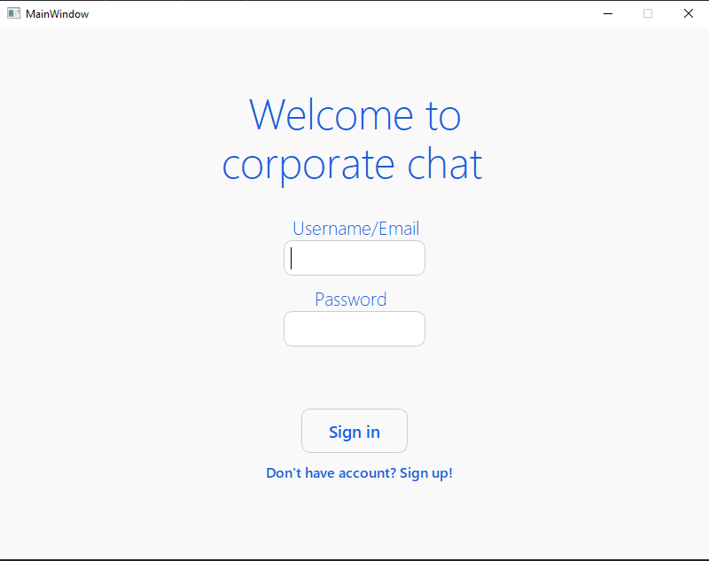
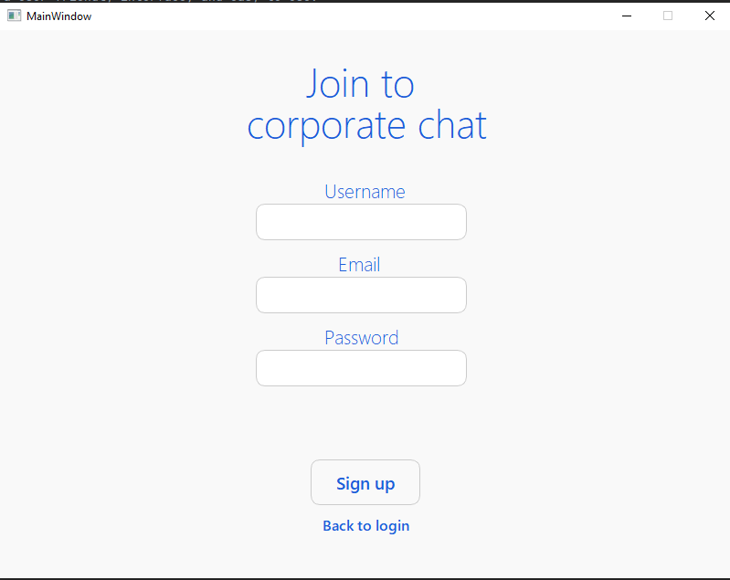
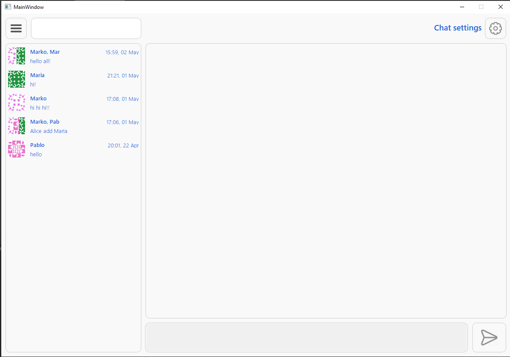
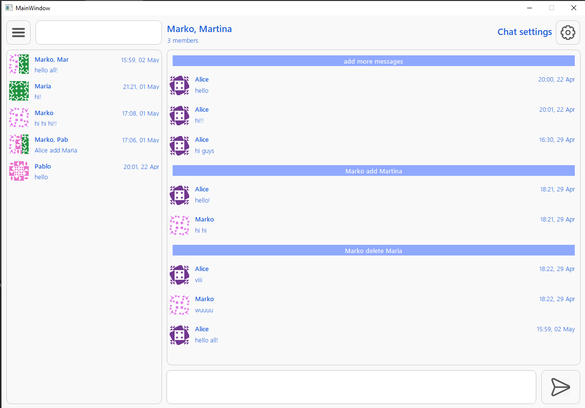
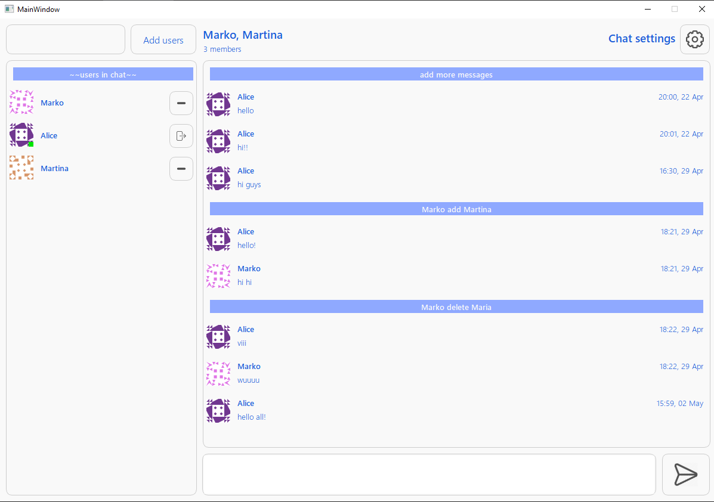
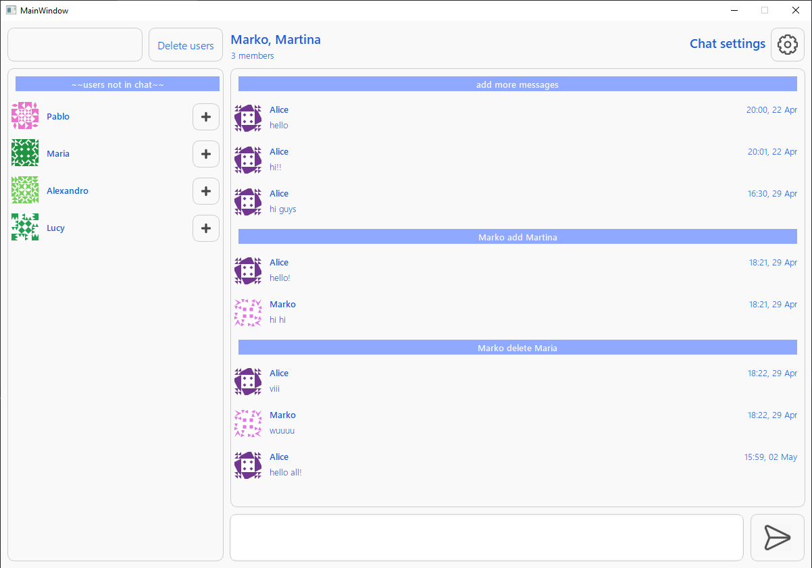
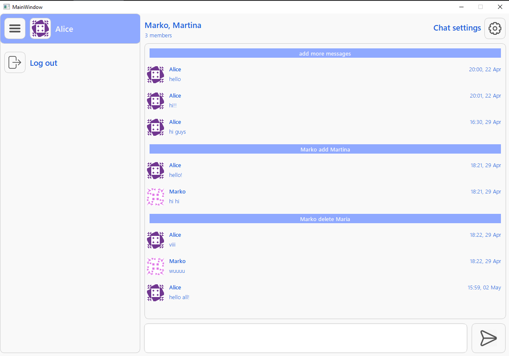

# corporate_chat
## Description
A simple python client-server application for communication. 
The chat has a user-friendly interface, and easy to use.
Using:
* `Python 3.8.2`,
* `Flask`,
* `PyQt 5`,
* `SQLAlchemy`,
* `SQLite`.
## Screenshots

